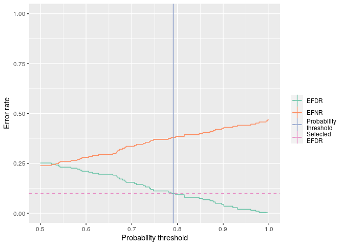

<!-- README.md is generated from README.Rmd. Please edit that file -->

bayefdr
=======

<!-- badges: start -->

<!-- badges: end -->

The goal of bayefdr is to provide tools for the estimation and
optimisation of Bayesian expected false discovery and expected false
negative rates.

Installation
------------

You can install the released version of bayefdr from
[CRAN](https://CRAN.R-project.org) with:

    install.packages("bayefdr")
    devtools::install_github("bayefdr")

Example
-------

The basic input to this function is a vector of probabilities and a
target FDR.

    library(bayefdr)
    probs <- runif(100)
    efdr <- efdr_search(probs, target_efdr = 0.1)
    plot(efdr)

